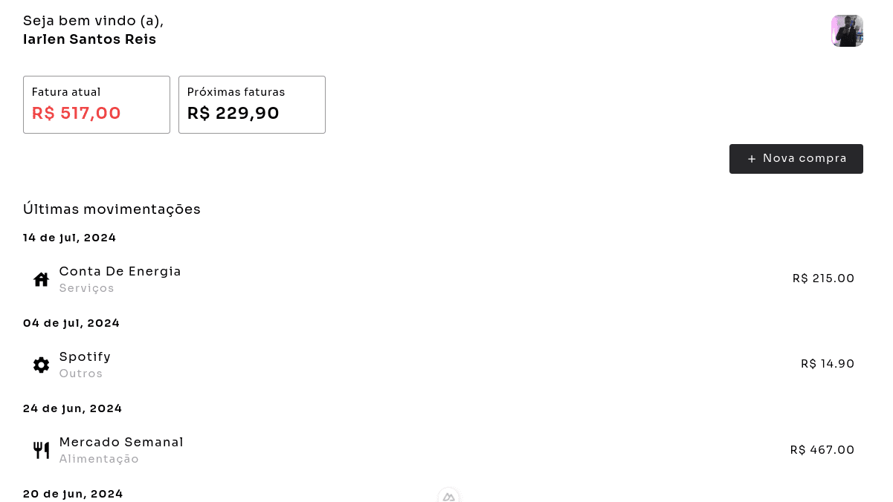
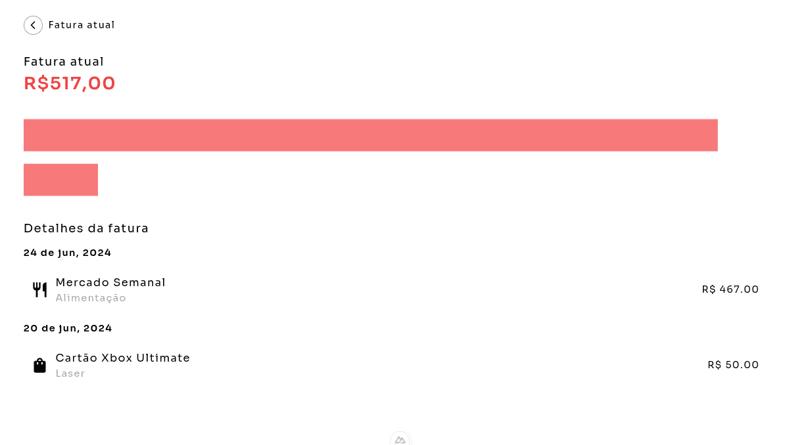

# HowMuch

HowMuch é uma aplicação de gerenciamento financeiro, com ela você pode tornar sua vida financeira mais organizada.

A API foi desenvolvida utilizando PHP com Laravel, você pode encontrar a documentação da API abaixo:

- [Repositório da API](https://github.com/iarlen-reis/HowMuch-API)

### Screenshot (Página inicial)

### Screenshot (Fatura atual)

## Stack utilizada

- Nuxt 3
- ChartJs
- Typescript
- Tailwind CSS

## Funcionalidades

- Autenticação com email/senha.
- Páginas para visualização e criação de compra.
- Página de visualização de fatura atual.
- Página de visualização de uma fatura específica.
- Página de visualização das proxímas faturas.
- Gráfico de detalhes da fatura.
- Pagina de perfil.
